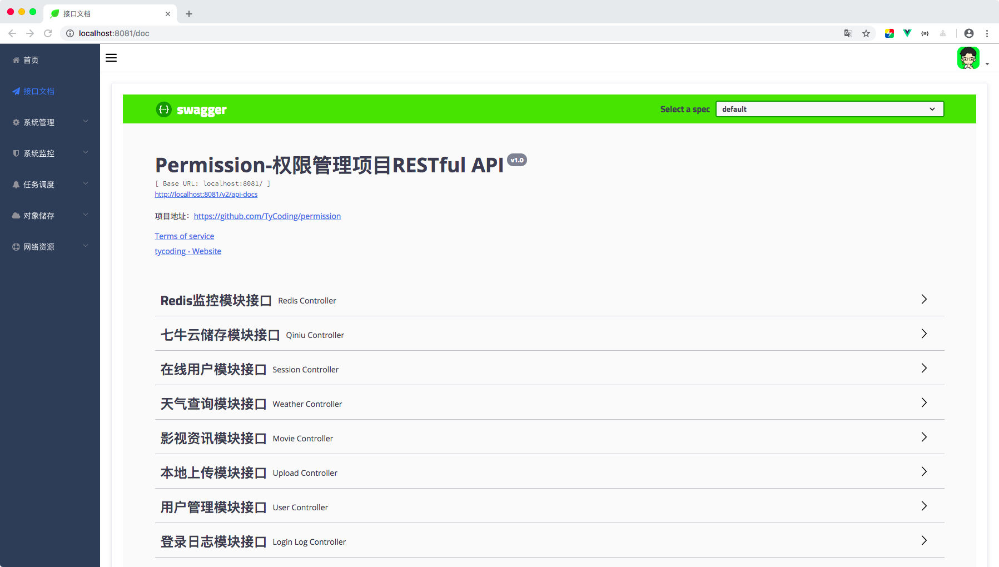
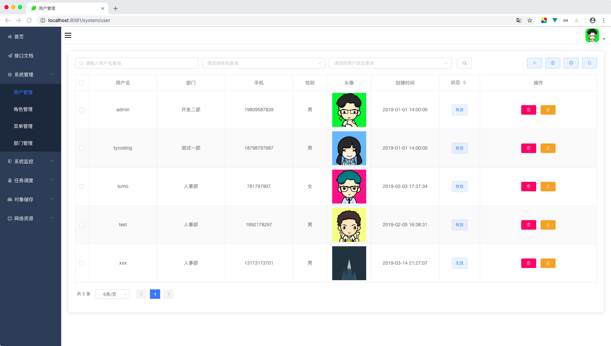
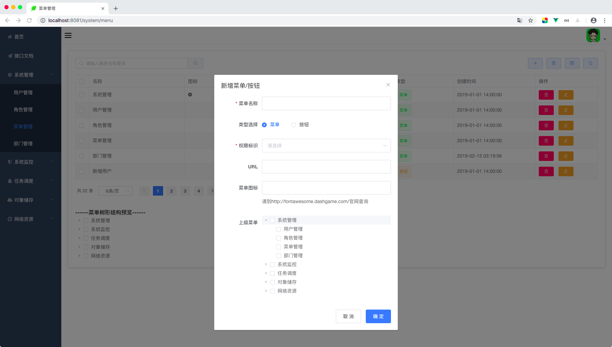
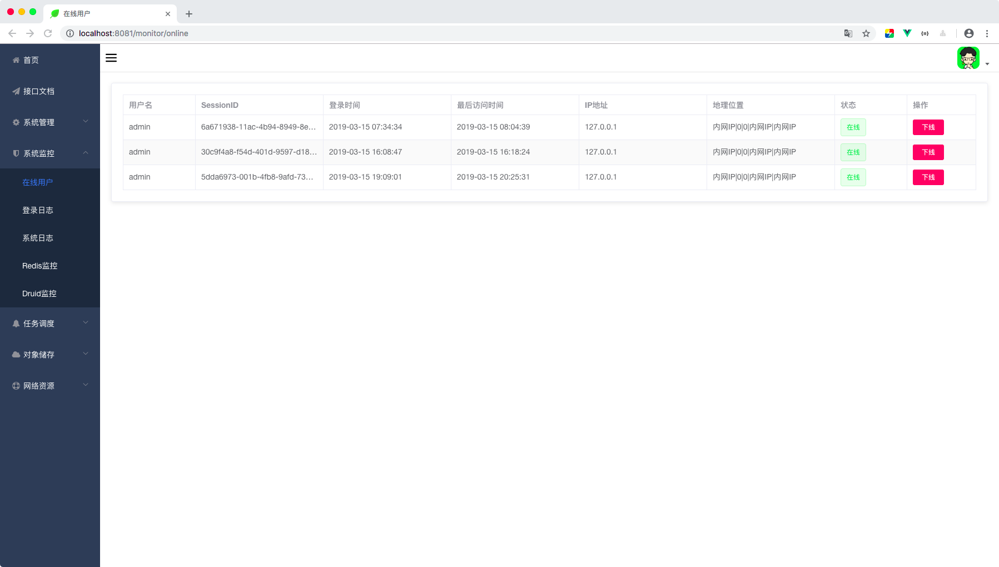
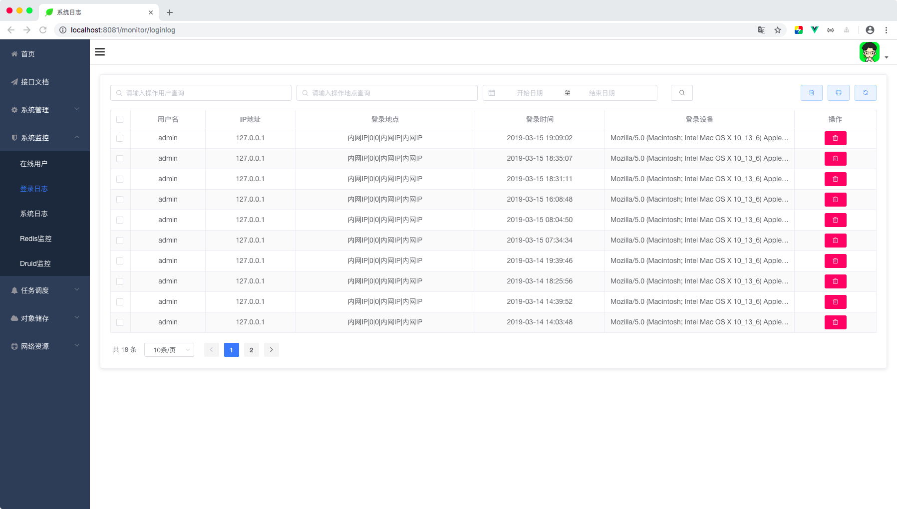
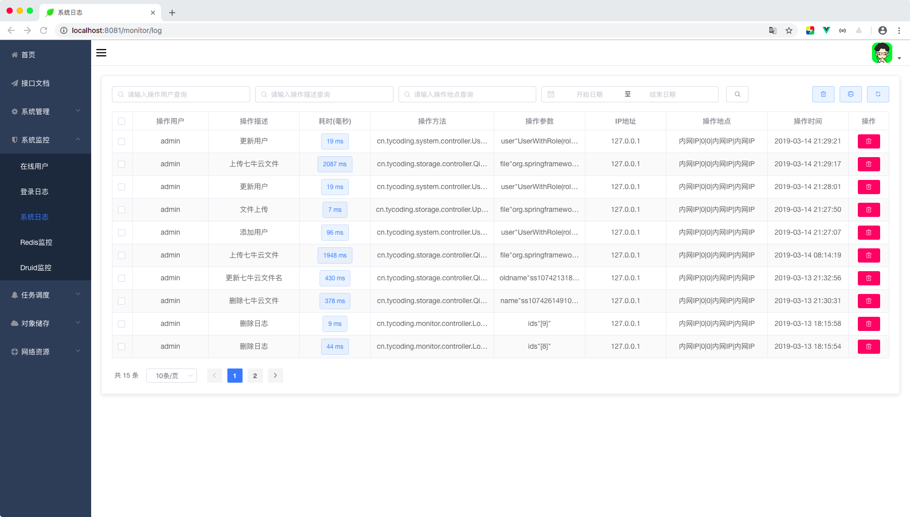
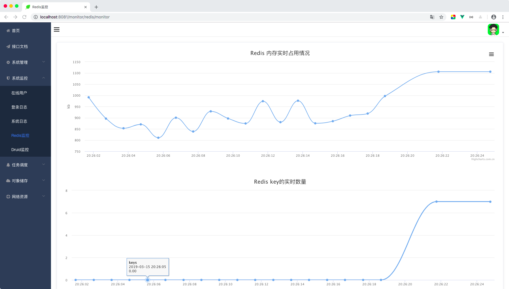
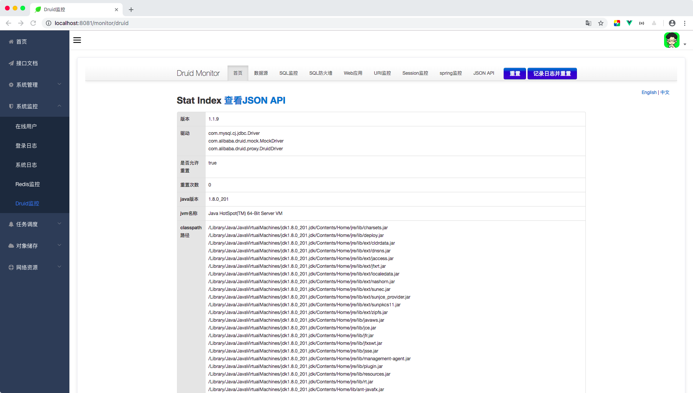
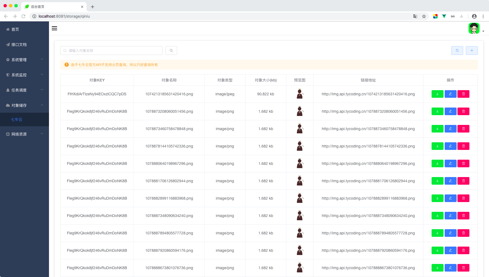
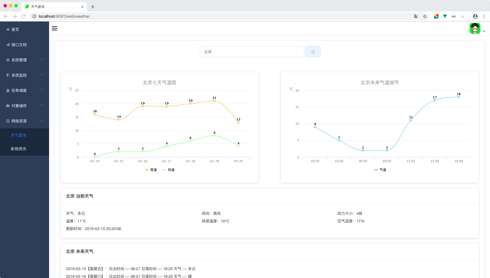

# Permission 一个权限管理系统

之前有学习了 [张开涛老师](https://jinnianshilongnian.iteye.com/blog/2018936) 老师的作品写的一个简单的 [Shiro入门级权限管理项目](https://github.com/TyCoding/shiro)，但由于一些原因感觉学习的不够深入，最近仔细拜读了 [wuyouzhuguli](https://github.com/wuyouzhuguli) 大神的作品，学习到了很多，顾写下此项目实战练习。 

**欢迎大家clone下来学习，如果可以，希望能点亮右上角star, fork，给作者一些鼓励**

## 致谢

* [wuyouzhuguli](https://github.com/wuyouzhuguli) 

可以说**本项目**仅是一个学习的项目，非常感谢这位大神的作品：[https://github.com/wuyouzhuguli/FEBS-Shiro](https://github.com/wuyouzhuguli/FEBS-Shiro)，**本项目**就来自学习了大神的项目后把自己理解的部分（加上自己的代码风格、思路）写了出来。欢迎大家学习这个项目，相信对大家的学习很有帮助。

## 功能模块

```
├─项目文档(Swagger2.0)
├─系统管理
│  ├─用户管理
│  ├─角色管理
│  ├─菜单管理
│  └─部门管理
├─系统监控
│  ├─在线用户
│  ├─登录日志
│  ├─系统日志
│  ├─Redis监控
│  └─Druid监控
├─对象储存
│  ├─七牛云
│─网络资源
│  ├─天气查询
│  └─影视资讯
```

## 文档 

* [在基于SpringBoot的前后端分离项目中使用Shiro](https://tycoding.cn/2019/01/25/springboot-shiro/)

* [Shiro在线会话管理](https://tycoding.cn/2019/02/16/54-shiro-session/)

* [Shiro权限管理项目中如何构建权限菜单](https://tycoding.cn/2019/01/30/shiro-tree/)

* [ElementUI - Tree & Shiro](https://tycoding.cn/2019/02/16/53-shiro-tree2-md/)

* 文档正在完善中...

## 技术选型

### 后端

* 基础框架： Spring Boot 2.1.2.RELEASE

* 持久层框架： MyBatis 3.4.6 

* 权限框架： Shiro 1.4.0

* 模板引擎： Thymeleaf 3.0.11.RELEASE

* 缓存框架： Redis 

* 其他： Swagger2、七牛云、Mybatis通用Mapper、druid、Logback、fastjson、pageHelper

### 前端

* 基础框架： ElementUI

* JavaScript插件： Vue.js

### 开发环境

* 语言： JDK1.8

* IDE： IDEA 2018.3

* 依赖管理： Maven

* 数据库： Mysql 5.7.24

## 写在前面

如果你看到技术选型可能会疑问前面完全依赖Vue.js，为何还是HTML页面？没错，前端是完全依赖Vue.js的，整个项目都没有用到JQuery。如果你学过Vue肯定熟悉NPM，Vue官方也推荐使用NPM开发，但为了更方便部署学习，这里使用HTML + Thymeleaf 解析页面。

虽然用了Thymeleaf，但也仅是用来解析页面视图地址，并没有在数据层用到Thymeleaf，所有的数据都依赖vue-resource异步获取，我以一张简单的图来解释项目交互流程：


### 部署

1. 克隆

```
git clone https://github.com/TyCoding/permission.git
```

2. 使用IDEA打开`permission`项目，创建数据库（执行`db/sys_schema.sql`）。

3. 修改`application.yml`中MySQL、Redis连接信息。（如果需要七牛云另完善七牛云的信息）。

4. 配置好Redis，启动Redis服务。

5. 启动项目，访问`localhost:8080`

6. 更多的文档后续补充...

## 项目截图
























